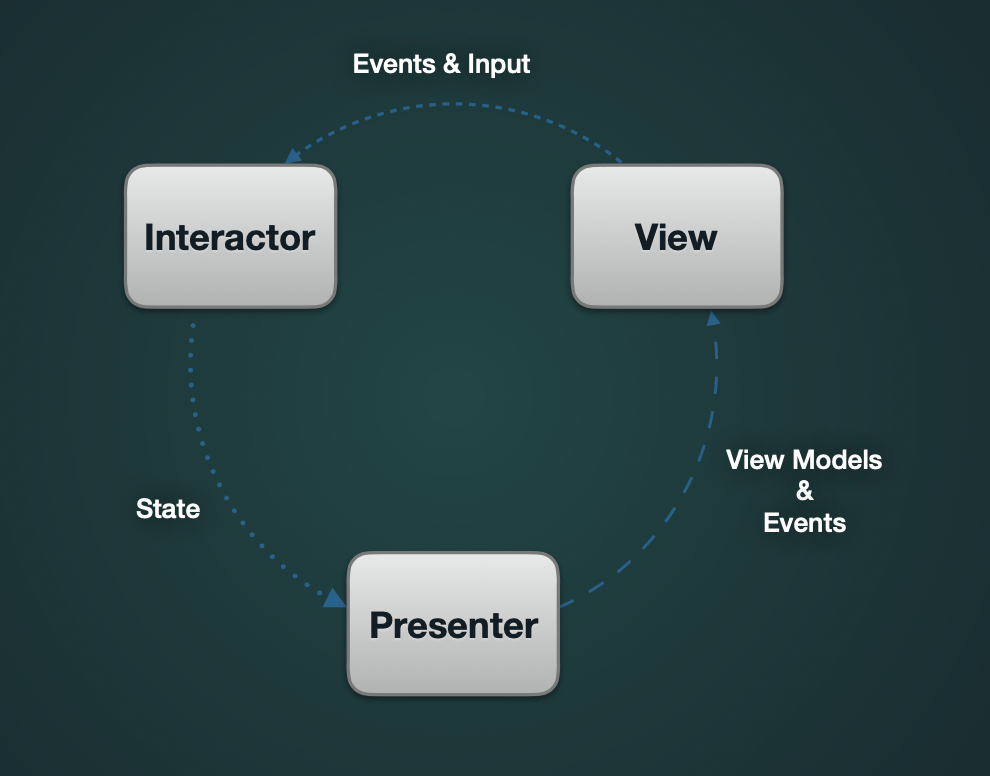
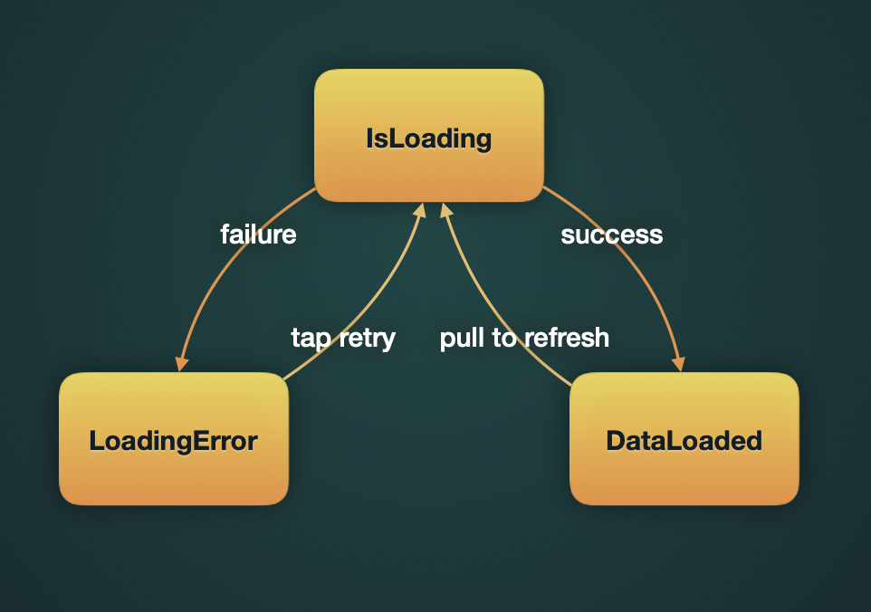

# StatefulScreenExample

Example of Profile screen with State and Unidirectional Data Flow. Interactor, Presenter and View are binded with RxSwift.

Firstly, install frameworks via carthage: carthage update --platform iOS --cache-builds

### StateDiagram:

